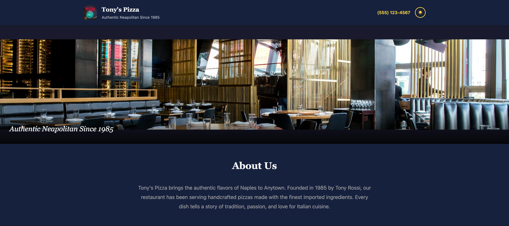
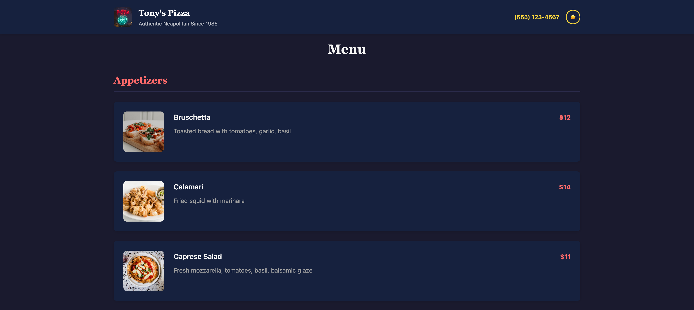
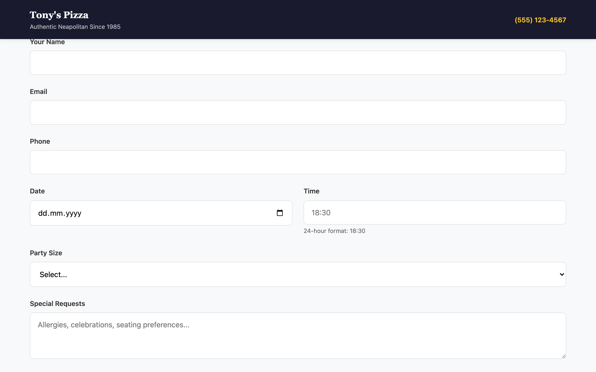
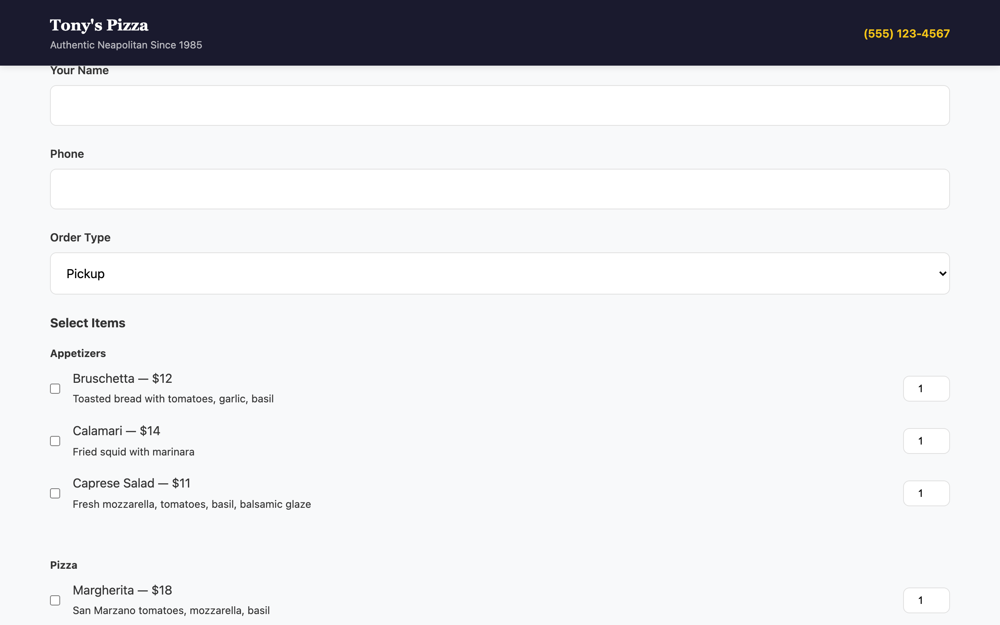

# Restaurant Site Starter Kit

**Get your restaurant a professional website in under 1 hour. No coding. No hosting costs. No third-party services.**

Your site will have:
- A beautiful, mobile-friendly menu (no PDFs!)
- Operating hours
- Location map
- Booking form (customers email you directly)
- Order form for pickup/delivery

## Option 1: The Easy Way (Edit in Your Browser)

**No Git experience? No problem.** You can edit everything directly in your web browser.

### Step 1: Create a GitHub Account (5 minutes)

1. Go to [github.com](https://github.com)
2. Click **Sign up** and create a free account
3. Verify your email address

### Step 2: Create Your Site (10 minutes)

1. Go to this repository: [gabegm/restaurant-site-starter](https://github.com/gabegm/restaurant-site-starter)
2. Click the **Fork** button in the top right (or "Use this template" → "Create a new repository")
3. Name your repository something like `tonys-pizza` or `yourrestaurantname`
4. Click **Create fork** (or **Create repository**)

### Step 3: Edit Your Menu (15 minutes)

1. In your new repository, find the file `_data/restaurant.md`
2. Click on it to open it
3. Click the **pencil icon** (✏️) in the top right to edit
4. Replace the example content with your restaurant's information:

   **Restaurant info** (top section, between the `---` lines):
   - `name`: Your restaurant name
   - `tagline`: A short description (optional)
   - `address`: Your address
   - `phone`: Your phone number
   - `email`: Your email (for booking/order forms)
   - `hours`: Your operating hours
   - `map`: Your coordinates (see below)
   - `booking: true` — shows a booking form
   - `delivery: true` — shows an order form

   **Your menu** (bottom section):
   ```
   ## Category Name
   - Item Name — $Price — Description
   ```

   To add a photo to a menu item, add a fourth section after the dashes:
   ```
   - Item Name — $Price — Description — /assets/menu/photo.jpg
   ```

5. Click **Commit changes** (green button) at the bottom

### Step 4: Get Your Map Coordinates (2 minutes)

1. Go to [openstreetmap.org](https://www.openstreetmap.org)
2. Search for your restaurant's address
3. Click **Share** → **Embed**
4. Copy the coordinates from the URL (they look like `40.7128, -74.0060`)
5. Paste them into the `map` field in `restaurant.md`

### Step 5: Add Your Logo and Hero Image (optional)

1. In your repository, click **Add file** → **Upload files**
2. Upload:
   - `logo.png` — your restaurant logo (square works best)
   - `hero.jpg` — a nice photo of your restaurant or food
3. Click **Commit changes**

### Step 6: Your Site is Live! (automatic)

Within 1-2 minutes, your site will be live at:
```
https://yourusername.github.io/your-repository-name
```

Check it! If something looks wrong, just edit `restaurant.md` and commit again — your site will update automatically.

---

## Option 2: The Advanced Way (Using Git)

If you're comfortable with Git, here's the quick version:

1. **Clone** this repository to your computer
2. **Edit** `_data/restaurant.md` with your info
3. **Push** to GitHub
4. Your site auto-deploys to `https://yourusername.github.io/repo-name`

See the [Troubleshooting](#troubleshooting) section below for help.

### Local Development (Preview Before Publishing)

Want to preview your site locally before pushing? Here's how:

```bash
# 1. Install dependencies
npm install

# 2. Start the local dev server (auto-reloads on changes)
npm run dev
```

Your site will be available at `http://localhost:3000`. Press `Ctrl+C` to stop the server.

To build for production (no live reload):

```bash
npm run build
```

---

## Customizing Your Design

The starter kit is designed to be customized. You can change anything — colors, layout, fonts, sections.

### Quick Customization (CSS Only)

Edit `assets/css/styles.css`:
- Change `--color-primary` and `--color-secondary` for different colors
- Change `--font-primary` for different fonts
- Adjust `--spacing-*` values for more/less whitespace
- Modify `--border-radius` for rounded or sharp corners

### Full Layout Override

Replace any template file in your repository:

| File | What it controls |
|------|------------------|
| `_layouts/default.njk` | Entire page structure (header, footer, sections) |
| `_includes/header.njk` | Top bar (logo, name, phone) |
| `_includes/hero.njk` | Hero section with background image |
| `_includes/menu.njk` | How the menu is displayed |
| `_includes/map.njk` | Map embed |
| `_includes/hours.njk` | Hours display |
| `_includes/contact.njk` | Contact info and social links |
| `_includes/booking-form.njk` | Booking form |
| `_includes/order-form.njk` | Order form |
| `assets/css/styles.css` | All styling |

**Example:** Want a single-page scrolling layout instead of sections? Replace `_layouts/default.njk` with your own HTML structure. The `restaurant.md` data is available as `restaurant` in all templates.

### Using Free Themes

If you find a free Eleventy or static site theme online, you can often adapt it:
1. Copy the theme's layout to `_layouts/default.njk`
2. Copy the theme's CSS to `assets/css/styles.css`
3. Update the template to use `restaurant.name`, `restaurant.menu`, etc.

The data structure is documented in the `restaurant.md` file — just map the theme's variables to our fields.

### Adding a New Language

Your site comes with English (default) and German. To add another language (e.g., Italian):

1. **Copy the German translation file** and rename it with the language code:
   ```bash
   cp _data/restaurant.de.json _data/restaurant.it.json
   ```

2. **Translate all the values** in the new file. The structure mirrors the English content:
   - `section_titles` — page section headers (Menu, Contact, Hours, etc.)
   - `menu_labels` — menu category names (Appetizers, Pizza, etc.)
   - `menu_items` — item names and descriptions
   - `forms` — form labels, placeholders, and button text
   - `about_text` — your restaurant story

3. **Register the file** in `.eleventy.js` — add one line to `addPassthroughCopy`:
   ```js
   "_data/restaurant.it.json": "_data/restaurant.it.json"
   ```

4. **Update the language toggle** in `js/forms.js` — change the cycle to include your new language:
   ```js
   const langs = ['en', 'de', 'it'];  // add your language code
   const current = getLanguage();
   const next = langs[(langs.indexOf(current) + 1) % langs.length];
   setLanguage(next);
   ```

The language button will cycle through all enabled languages. Customers pick their language once — it's saved in their browser.

## Custom Domain

Want to use `www.yourrestaurant.com` instead of GitHub Pages?

1. Create a file named `CNAME` (no extension) in your repository
2. Add your domain: `www.yourrestaurant.com`
3. Point your domain's DNS CNAME record to `yourusername.github.io`
4. Push the file — GitHub Pages will detect it automatically

This may take up to 48 hours to propagate.

---

## What Each Field Does

| Field | Required | What it does |
|-------|----------|-------------|
| `name` | ✅ Yes | Your restaurant name (shows in title, header, footer) |
| `phone` | ✅ Yes | Your phone number (clickable on mobile — opens dialer) |
| `address` | ✅ Yes | Your address (shows in footer, contact section, map) |
| `tagline` | No | A short tagline (shows in hero section) |
| `email` | No | Your email (booking/order forms send to this) |
| `hours` | No | Your operating hours (shows in hours section) |
| `logo` | No | Path to your logo file (shows in header, optional) |
| `hero` | No | Path to your hero image (shows as background) |
| `map` | No | Coordinates for the map (format: `"lat, lon"`) |
| `social` | No | Social media links (Instagram, Facebook, etc.) |
| `about` | No | Your restaurant's story (shows in about section) |
| `booking` | No | Set to `true` to show a booking form |
| `delivery` | No | Set to `true` to show an order form |

---

## Menu Format

```markdown
## Category Name
- Item Name — $Price — Description
- Item Name — $Price — Description — /assets/menu/photo.jpg
```

- Categories start with `##`
- Items start with `- ` followed by `—` (em dash) separators
- The photo path is optional (append after a third `—`)
- You can add as many categories and items as you want

**Example:**
```markdown
## Appetizers
- Bruschetta — $12 — Toasted bread with tomatoes, garlic, basil
- Calamari — $14 — Fried squid with marinara — /assets/menu/calamari.jpg

## Pizza
- Margherita — $18 — San Marzano tomatoes, mozzarella, basil
```

---

## Adding Images

Place your images in the appropriate folders:

- `logo.jpg` — Restaurant logo (square works best, optional)
- `hero.jpg` — Hero/background image (place in root folder)
- `assets/menu/` — Menu item photos (create this folder if needed)

To upload images:
1. In your repository, click **Add file** → **Upload files**
2. Drag and drop your images
3. Click **Commit changes**

---

## Troubleshooting

### My site isn't updating after I push changes

- Make sure you pushed to the `main` branch
- Check the **Actions** tab on GitHub for build errors
- GitHub Pages can take 1-2 minutes to update

### My build is failing

- Check that `restaurant.md` has valid YAML in the frontmatter (the section between `---`)
- Make sure `name`, `phone`, and `address` are present (these are required)
- Check the **Actions** tab for specific error messages

### My map isn't showing

- Make sure `map` is set in the frontmatter with coordinates: `"lat, lon"`
- Example: `"40.7128, -74.0060"`
- Get your coordinates from [openstreetmap.org](https://www.openstreetmap.org)

### My menu items aren't showing

- Make sure each category starts with `## ` (two hash marks and a space)
- Make sure each item starts with `- ` (dash and space)
- Make sure you're using em dashes (`—`) to separate name, price, and description
  - On Mac: `Option + Shift + Minus`
  - On Windows (with numeric keypad): Hold `Alt`, type `0151`, release
  - On Windows (laptop without keypad): Press `Win + .` → search "em dash"

### I don't have a GitHub account

- Go to [github.com](https://github.com) and sign up for free
- It takes about 2 minutes

---

## Screenshots

### Homepage
Shows the hero image, menu with photos, hours, map, and contact info.



### Menu
Displays your restaurant's menu with categories, items, prices, descriptions, and optional photos.



### Map
Shows your restaurant's location with an embedded interactive map.


### Booking Form
Customers can book a table by filling in their name, email, phone, date, time (24-hour format), party size, and special requests.



### Order Form
Customers can order for pickup or delivery, select menu items with quantities, and add special instructions.



---

## Live Example

See a working example at: [gabegm.github.io/restaurant-site-starter](https://gabegm.github.io/restaurant-site-starter)

---

## License

MIT
